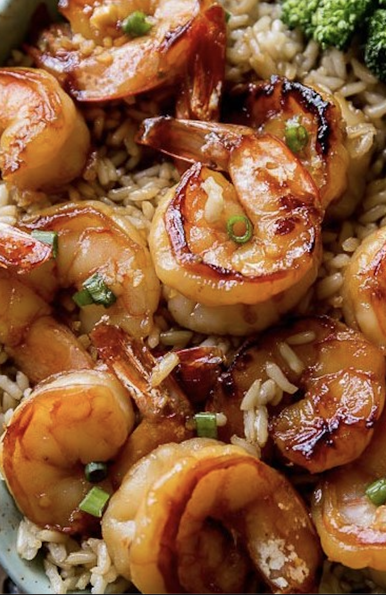

<!DOCTYPE html>
<html lang='en'>
<head>
    <meta charset='UTF-8'>
    <meta http-equiv='X-UA-Compatible' content='IE=edge'>
    <meta name='viewport' content='width=device-width, initial-scale=1.0'>
    <title>MiHealth</title>
    <link rel='stylesheet' href='styles.css'>
    <link rel='stylesheet' href='https://fonts.googleapis.com/css?family=Secular+One'>
</head>
<body>
    

        <nav id='logo'>
            MIHEALTH
        </nav>
        <nav class="link">
        <nav class="link">Breakfast</nav>
        <nav class="link">Lunch</nav>
        <nav class="link">Dinner</nav>
        <nav class="link">Dessert</nav>
    

    

        

            <h1 id='title'>Be Healthy</h1>
            

                Lorem ipsum dolor sit amet,
                consectetur adipiscing elit, sed
                do eiusmod tempor incididunt ut
                labore et dolore magna aliqua.
                Quis ipsum suspendisse ultrices
                gravida. Risus commodo viverra 
                maecenas accumsan lacus vel facilisis.
            

            
BROWSE MENU &rarr;

        

        

            

                 
                
FRESH

                
BREAKFAST

            

            

                 
                
SWEET

                
LUNCH

            

            

             
                
DELICIOUS

                
DINNER

            

        

    

</body>
</html>
